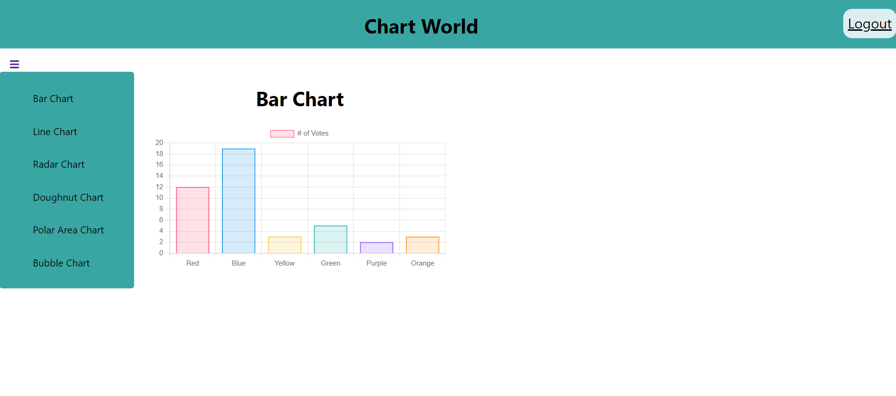
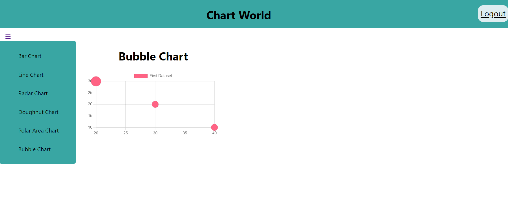

## Chart World
A Webapp to show data in chart form.

## Project Screen Shot(s)

## Installation and Setup Instructions

#### Example:  

Clone down this repository. You will need `node` and `npm` installed globally on your machine.  

Installation:

`npm install`  

To Run Test Suite:  

`npm test`  

To Start Server:

`npm start`  

To Visit App:

`localhost:3000`  

# Chart-World
